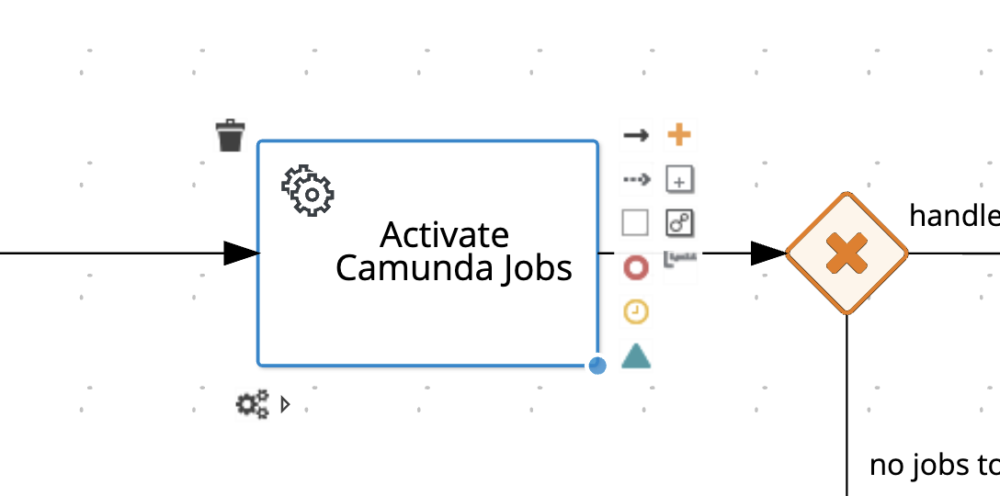
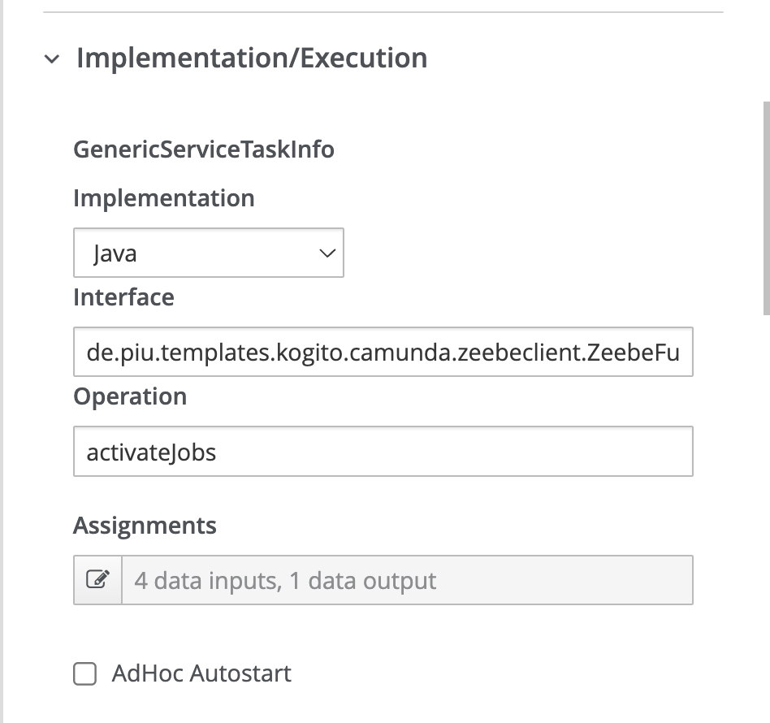
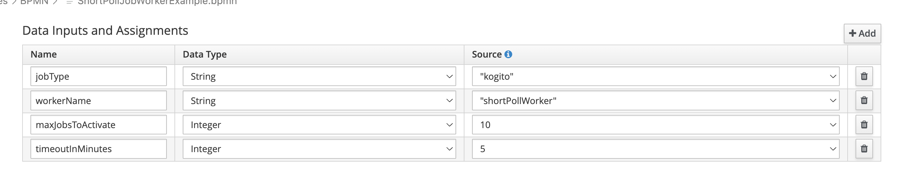

# Kogito Template for Camunda 8 Service Tasks (External Tasks)

This template showcases how Kogito is leveraged as an External Service Task Worker, Handler, and Service. It enables us to apply our BPMN expertise in the context of service tasks. Finally, upon the completion and operational status of the service, the documentation is available because the process itself is the documentation.

# Advantages

## Decision Makers:
Product Owners benefit from comprehensive transparency regarding the progress and development status of a service at all times. This constant insight allows for effective control and adjustment of project objectives, ensuring optimal resource allocation and facilitating decision-making at every level of the project.

## Developers:
Developers enjoy the advantage of being able to design every part of the service efficiently and free from unnecessary bulk (BloatCode). This lean development approach promotes high code quality and maintainability. Moreover, each component of the service is individually testable, which eases the detailed examination and validation of functionalities. Integration tests can be implemented simply and effectively thanks to the modular structure and clear interfaces between service components. This method not only improves the reliability and stability of the entire service but also accelerates the development process through rapid feedback and early identification of potential issues.

# How to use it?

To experiment with the processes, please use Visual Studio Code and load the Kogito Bundle extension.

1. Pull this repository with VSC.
2. Configure your Zeebe gateway address in the 'application.properties' file.
3. Start the Service : mvn clean install quarkus:dev.
4. Start the Camunda Process from the Camunda folder.

or

3. Open ShortPollJobWorkerExample.bpmn.
    3.1 Click on "Activate Camunda Jobs"-Service Task.
    
    3.2 Open Properties.
    
    
    3.3 Open Zeebe Client Properties.
    
    3.4 Configure your JobType.
5. Start the Service : mvn clean install quarkus:dev.
6. Start Camunda 8.
7. Start your Camunda 8 Process.

# Test
A Simple Test Example is provided in the test Folder. 

Copyright 2024 www.piu.de